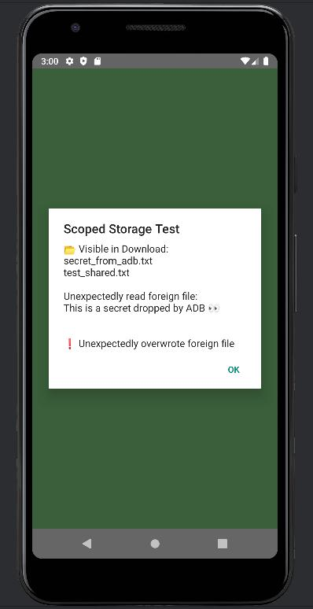

# 📂 Scoped Storage Demonstration – Android 9 vs Android 16

This branch modifies the home screen of the app to demonstrate the implications of Android's **Scoped Storage** system introduced in later versions of Android.

## 🔍 Overview

The demonstration focuses on how different Android versions handle access to files stored in external storage, specifically:

1. ✅ Writing files to:
   - Shared external storage (`/sdcard/Download`)
   - App-specific external directories (`/sdcard/Android/data/<package>/files`)
2. ✅ Attempting to read and overwrite a **foreign file** (`secret_from_adb.txt`) pushed via `adb`, which the app does **not** own.

---

## Test Setup

### 🔧 File Preparation
A file named `secret_from_adb.txt` was pushed into the shared `Download/` directory via:

```bash
adb push secret_from_adb.txt /sdcard/Download/
```

### Android Environments Used

#### ✅ Android 9 "Pie" (API 28) - ARM64 Emulator
- App **successfully wrote** to both shared and app-specific external storage.
- App **was able to read and overwrite** the foreign file `secret_from_adb.txt`.
- ➕ Scoped Storage is **not enforced**, so `WRITE_EXTERNAL_STORAGE` grants broad access.

##### Evidence (Unrestricted Access on Android 9)



#### 🔒 Android 16 "Baklava" (API 35) - ARM64 Emulator
- App could **only read/write files it created itself**.
- App **could not read or overwrite** the foreign file `secret_from_adb.txt`.
- ➕ Scoped Storage is **enforced by default**, isolating the app's access to only its own files.

---

## ⚠️ Security Implication

On older Android versions (≤ 9), granting the `WRITE_EXTERNAL_STORAGE` permission gives apps:
- **Full access** to all files in shared storage
- The ability to **read, modify, or delete** files from other sources (e.g. via ADB, another app)

This increases the risk of:
- Data exfiltration
- Malicious overwrite
- Privilege misuse

---

## 🛡️ Recommended Control

To mitigate this risk:
- **Target newer Android versions** (API 30+)
- Encourage users to **upgrade their OS** to Android 11+ where Scoped Storage is **strictly enforced**
- Understand that even if `WRITE_EXTERNAL_STORAGE` is granted, its scope is **limited** on newer Android versions

---

## 📂 File Paths Used in Test

| File Description          | Path |
|---------------------------|------|
| App-specific file         | `/storage/emulated/0/Android/data/<package>/files/test_app_specific.txt` |
| Shared external file      | `/storage/emulated/0/Download/test_shared.txt` |
| ADB-injected foreign file | `/storage/emulated/0/Download/secret_from_adb.txt` |

---

## ✅ Summary

This branch highlights how **Scoped Storage** fundamentally shifts Android’s storage security model and how older permissions like `WRITE_EXTERNAL_STORAGE` become more controlled in modern Android.

> 🔐 **Upgrade your target SDK and device OS to ensure your app is protected by default Scoped Storage controls.**

## Author

**Nicholas Tok**

